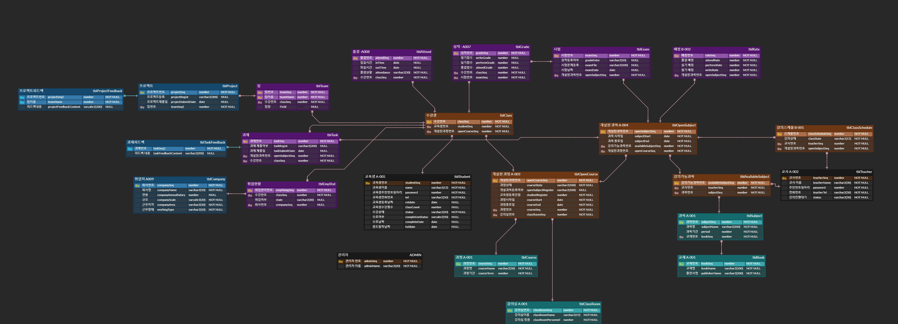
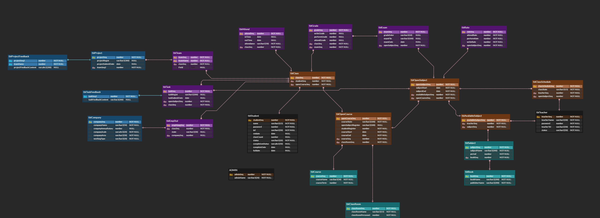

# SIST 교육센터 운영 DB
## SIST Oracle Project

[](https://travis-ci.org/joemccann/dillinger)

## Requirements
교육기관 : 쌍용 교육 센터
강의실 : 6개
강의실 교육 최대 인원수 : 1, 2, 3 강의실(30명), 4, 5, 6 강의실(26명)
관리자 : 3~5명(모두 권한 동급)
교사 : 현시점 강의 인원(6명), 현시점 대기 인원(4명)
진행 과정 : 6개 강의실 모두 진행 중
과정 기간 : 5.5개월 or 6개월 과정 or 7개월 과정
과목 수 : 30 ~ 50 과목.
센터 전체 프로세스 : 과정 생성(과정을 정의한다. 과정 목표, 과목 구성, 전체 기간 등) → 과정 시행 확정(과정 선택 + 강의실 선정 + 교사 배정 등) → 모집 → 교육생 선발 → 개강 → 운영(학생 관리 + 출결 + 상담 + 교재배부 + 시험 등) → 종강 → 사후처리(취업 & 고용보험 가입 확인 & 재취업 지원)

- 위의 최소 조건을 만족하는 DB프로그램을 만드는 것을 목표로 한다.
- 5명 구성원 1개월 작업.

## Features
- 본 시스템은 교육기관에서 과정을 구성하고 강의 일정을 운영하는 것을 목표로 한다.
- 본 시스템은 교육기관에서 과정을 수강한 교육생들에 대한 과목별 성적 처리를 목표로 한다.
- 본 시스템 운영을 위해서 관리자, 교사, 교육생으로 사용자를 구분한다.
- 본 시스템 운영의 모든 권한은 관리자가 가진다.
- 교사는 성적 처리와 관련된 일부 권한을 가진다.
- 교육생은 성적 조회에 관련된 일부 권한을 가진다.
- 모든 권한 사용은 로그인 기능을 이용해서 로그인 후에만 사용할 수 있다.
- 관리자는 계정 기능을 이용해서 교사 등록 및 관리, 교육생 등록 및 관리를 하게 된다.
- 관리자는 기초 정보 관리 기능을 이용해서 기초 정보 등록 및 관리를 하게 된다.
- 관리자는 교사 계정 관리 기능을 이용해서 교사 정보 등록 및 관리를 하게 된다.
- 관리자는 개설 과정 관리 기능을 이용해서 과정 정보 등록 및 관리를 하게 된다. 과정 편성시 강의실을 배정하게 된다.
- 관리자는 개설 과목 관리 기능을 이용해서 과목 정보 등록 및 관리를 하게 된다. 과목 편성시 교사를 배정하게 된다. 교사의 강의 가능 과목을 참고한다.
- 관리자는 교육생 관리 기능을 이용해서 교육생 정보 등록 및 관리를 하게 된다.
- 관리자는 성적 조회 기능을 이용해서 교육생의 성적 조회를 하게 된다.
- 교사는 강의스케줄 조회 기능을 이용해서 강의스케줄 조회를 하게 된다.
- 교사는 배점 입출력, 성적 입출력 기능을 이용해서 교육생 성적 등록 및 관리를 하게 된다.
- 교육생은 성적 조회 기능을 이용해서 성적 조회를 하게 된다.


## Tech

- Oracle
    - DDL
        Create Alter Drop문을 사용하여 테이블을 생성, 변경, 삭제 하였다.
    - DML
        Select Insert Update Delete문을 사용하여 값을 선택, 삽입, 수정, 삭제 하였다.
    - DCL 외 기타
        Savepoint를 활용하여 트랜잭션 오류시 rollback을 활용하였고 트랜잭션에 잘못된 데이터가 들어가면 무결성이 지켜지도록 constraints를 걸어 최대한 무결성을 깨뜨지지 않기 위해 노력했다.
        그 외에도 뷰, 인덱스, 함수, 트리거, 프로시저를 적극 활용해서 운영상의 편의와 성능을 개선하였다.
        Dummy Data를 만들기 위해서 다음과 같은 PL/SQL 코드를 사용하였다.
        
```
-- 1~5번 출결 랜덤 데이터
declare
    venter        date ;
    vexit         date ;
    vseq          number := 1;
    vclassSeq     number := 1;
    vopencouseseq number;

begin
    while vclassSeq <= 146
        loop
            select OPENCOURSESEQ into vopencouseseq from tblclass where classseq = vclassSeq;
            if vopencouseseq = 1 then
                venter := to_date('2021-01-04:08:46:00', 'yyyy-mm-dd:hh24:mi:ss');
                vexit := to_date('2021-01-04:17:55:00', 'yyyy-mm-dd:hh24:mi:ss');
            elsif
                vopencouseseq = 2 then
                venter := to_date('2021-02-07:08:46:00', 'yyyy-mm-dd:hh24:mi:ss');
                vexit := to_date('2021-02-07:17:55:00', 'yyyy-mm-dd:hh24:mi:ss');
            elsif
                vopencouseseq = 3 then
                venter := to_date('2021-03-28:08:46:00', 'yyyy-mm-dd:hh24:mi:ss');
                vexit := to_date('2021-03-28:17:55:00', 'yyyy-mm-dd:hh24:mi:ss');
            elsif vopencouseseq = 4 then
                venter := to_date('2021-04-11:08:46:00', 'yyyy-mm-dd:hh24:mi:ss');
                vexit := to_date('2021-04-11:17:55:00', 'yyyy-mm-dd:hh24:mi:ss');
            elsif vopencouseseq = 5 then
                venter := to_date('2021-05-27:08:46:00', 'yyyy-mm-dd:hh24:mi:ss');
                vexit := to_date('2021-05-27:17:55:00', 'yyyy-mm-dd:hh24:mi:ss');
            end if;
            while venter < sysdate
                loop
                    venter := venter + 1;
                    vexit := vexit + 1;

                    if mod(to_char(venter, 'd'), 7) + 1 in (1, 2) then --주말
                        continue;
                    end if;
                    insert into tblattend
                    values (vseq, venter + dbms_random.value(0, 20) / (24 * 60),
                            vexit + dbms_random.value(0, 20) / (24 * 60), '정상', vclassSeq);

                    vseq := vseq + 1;
                end loop;
            vclassSeq := vclassSeq + 1;
        end loop;
end;
```
        


    

## Review
처음 사용해보는 Oracle Database 프로젝트였다. 기본적인 select문만 알았을 뿐이였는데 이번 프로젝트를 통해 테이블(개체)간의 관계를 설정하는 ERD도 작성해보고 이를 기반으로 실제로 테이블을 구현해보고 제약사항을 걸어 무결성을 깨지 않으려고 노력했다. 뿐만아니라 Dummy Data또한 PL/SQL의 강력한 기능으로 만들 수 있었다. DB를 구현해본 경험이 많이 없었는데 이번 기회를 통해 관계형 데이터베이스가 어떤 구조로 이루어져 있는지, 어떻게 관계를 설정하며 이 관계를 통해 어떻게 전체적인 DB를 구성하는지에 대해 알 수 있었다. 이를 얼마나 잘 구현하는지에 따라 성능의 차이가 많이 발생하겠다 라는것을 느꼈다. 또한 프론트에서 값을 받으면 백엔드에서 무엇을 하는지 대략적인 흐름을 파악할 수 있었다. 또한 백업의 중요성과 초기 DB 작업의 중요성을 알게 됐다. 백업은 최대한 많이, 결함은 초기에 잡아야 뒤로 갈수록 문제가 Snowball이 되어 돌이킬 수 없는 사태를 미연에 방지할 수 있다는것을 다시 한번 느낀 프로젝트였다.

## Result




## License

MIT


[//]: # (These are reference links used in the body of this note and get stripped out when the markdown processor does its job. There is no need to format nicely because it shouldn't be seen. Thanks SO - http://stackoverflow.com/questions/4823468/store-comments-in-markdown-syntax)
